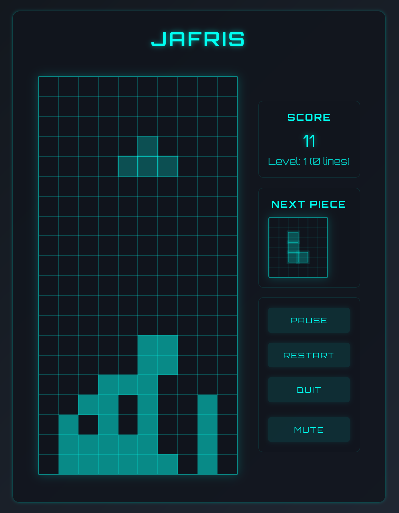

# Jafris - Tetris Clone

An implementation of the classic Tetris game built with Python (Flask) backend and JavaScript frontend. Features a sleek neon-cyberpunk design with responsive controls and audio feedback.



## Features
- Classic Tetris gameplay mechanics
- Responsive design for desktop devices
- Keyboard controls
- Real-time score tracking and level progression
- Dynamic difficulty scaling
- Sound effects and background music
- Pause/Resume functionality
- Neon-cyberpunk visual theme

## Project Structure
```
jafris/
├── dev/
│   └── app.py           # Flask development server
├── assets/
│   ├── js/
│   │   └── game.js      # Game logic and controls
│   ├── css/
│   │   └── style.css    # Neon-themed styling
│   └── audio/           # Game sound effects
│       ├── theme-a.mp3
│       ├── rotate.mp3
│       ├── clear.mp3
│       ├── drop.mp3
│       ├── levelup.mp3
│       └── gameover.mp3
├── index.html           # Main game page
├── screenshot.png       # Game screenshot
└── README.md
```

## Prerequisites
- Modern web browser (Chrome, Firefox, Safari, or Edge)
- Python 3.x and Flask (for development only)

## Development

1. Install Flask:
   ```bash
   pip install flask
   ```

2. Start the development server:
   ```bash
   cd dev
   python app.py
   ```

3. Open your browser and navigate to [http://localhost:5000](http://localhost:5000)

## Deployment
The game can be deployed on any static file hosting service:

1. GitHub Pages:
   - Push the repository to GitHub
   - Enable GitHub Pages in repository settings
   - Select the main branch as source

2. Any static file host:
   - Upload all files except the `dev` directory
   - Configure your web server to serve `index.html` as the default page

## Controls
- ←/→ : Move piece left/right
- ↑ : Rotate piece
- ↓ : Soft drop (faster fall)
- Space : Hard drop (instant fall)
- P : Pause game

## Scoring System
- Single line: 40 × level
- Double line: 100 × level
- Triple line: 300 × level
- Tetris (4 lines): 1200 × level
- Soft drop: 1 point per cell
- Hard drop: 2 points per cell

## Development Stack
- Vanilla JavaScript for game logic
- HTML5 Canvas for rendering
- CSS3 for neon styling and animations
- Web Audio API for sound effects
- Flask for development server (optional)

Enjoy playing!
